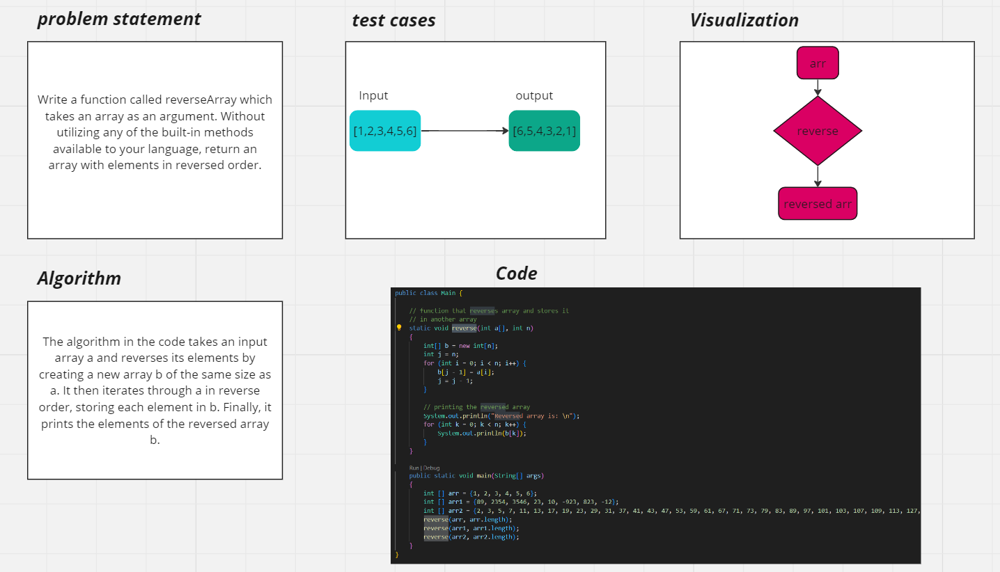

# Array Reverse
<!-- Description of the challenge -->
Write a function called reverseArray which takes an array as an argument. Without utilizing any of the built-in methods available to your language, return an array with elements in reversed order.

## Whiteboard Process
<!-- Embedded whiteboard image -->

## Approach & Efficiency
<!-- What approach did you take? Why? What is the Big O space/time for this approach? -->
The approach taken in this code is to create a new array b of the same size as the input array a. It then iterates through the input array a in reverse order, storing the elements in the new array b. Finally, it prints the elements of the reversed array b.

## Solution
<!-- Show how to run your code, and examples of it in action -->
public class Main {

	// function that reverses array and stores it
	// in another array
	static void reverse(int a[], int n)
	{
		int[] b = new int[n];
		int j = n;
		for (int i = 0; i < n; i++) {
			b[j - 1] = a[i];
			j = j - 1;
		}

		// printing the reversed array
		System.out.println("Reversed array is: \n");
		for (int k = 0; k < n; k++) {
			System.out.println(b[k]);
		}
	}

	public static void main(String[] args)
	{
		int [] arr = {1, 2, 3, 4, 5, 6};
        int [] arr1 = {89, 2354, 3546, 23, 10, -923, 823, -12};
        int [] arr2 = {2, 3, 5, 7, 11, 13, 17, 19, 23, 29, 31, 37, 41, 43, 47, 53, 59, 61, 67, 71, 73, 79, 83, 89, 97, 101, 103, 107, 109, 113, 127, 131, 137, 139, 149, 151, 157, 163, 167, 173, 179, 181, 191, 193, 197, 199};
		reverse(arr, arr.length);
        reverse(arr1, arr1.length);
        reverse(arr2, arr2.length);
	}
}
