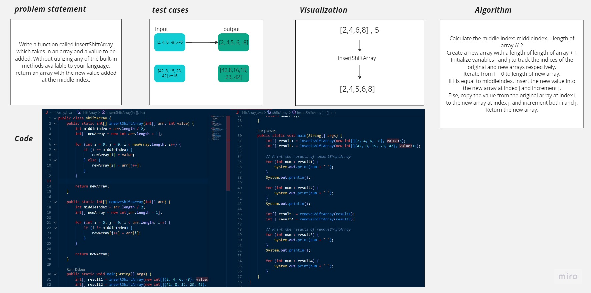

# Array Insert Shift
<!-- Description of the challenge -->
Write a function called insertShiftArray which takes in an array and a value to be added. Without utilizing any of the built-in methods available to your language, return an array with the new value added at the middle index.

## Whiteboard Process
<!-- Embedded whiteboard image -->

## Approach & Efficiency
<!-- What approach did you take? Why? What is the Big O space/time for this approach? -->
insertShiftArray function :
Calculate the middle index of the input array.
Create a new array with a length one more than the original array.
Iterate through both the original and new arrays.
Insert the new value at the middle index in the new array.
Copy elements from the original array to the new array.

removeShiftArray function :
Calculate the middle index of the input array.
Create a new array with a length one less than the original array.
Iterate through the original array.
Copy elements to the new array, excluding the middle index element.

## Solution
<!-- Show how to run your code, and examples of it in action -->

public class shiftArray {
    public static int[] insertShiftArray(int[] arr, int value) {
        int middleIndex = arr.length / 2;
        int[] newArray = new int[arr.length + 1];

        for (int i = 0, j = 0; i < newArray.length; i++) {
            if (i == middleIndex) {
                newArray[i] = value;
            } else {
                newArray[i] = arr[j++];
            }
        }

        return newArray;
    }

    public static int[] removeShiftArray(int[] arr) {
        int middleIndex = arr.length / 2;
        int[] newArray = new int[arr.length - 1];

        for (int i = 0, j = 0; i < arr.length; i++) {
            if (i != middleIndex) {
                newArray[j++] = arr[i];
            }
        }

        return newArray;
    }

    public static void main(String[] args) {
        int[] result1 = insertShiftArray(new int[]{2, 4, 6, -8}, 5);
        int[] result2 = insertShiftArray(new int[]{42, 8, 15, 23, 42}, 16);

        // Print the results of insertShiftArray
        for (int num : result1) {
            System.out.print(num + " ");
        }
        System.out.println();

        for (int num : result2) {
            System.out.print(num + " ");
        }
        System.out.println();

        int[] result3 = removeShiftArray(result1);
        int[] result4 = removeShiftArray(result2);

        // Print the results of removeShiftArray
        for (int num : result3) {
            System.out.print(num + " ");
        }
        System.out.println();

        for (int num : result4) {
            System.out.print(num + " ");
        }
    }
}
