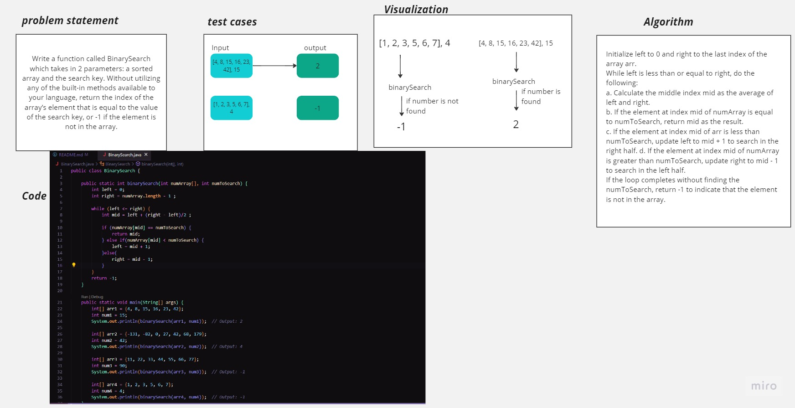

# Binary Search
<!-- Description of the challenge -->

## Whiteboard Process
<!-- Embedded whiteboard image -->

## Approach & Efficiency
<!-- What approach did you take? Why? What is the Big O space/time for this approach? -->
The approach used in the provided BinarySearch function is a standard binary search algorithm. Binary search is an efficient algorithm for finding an element in a sorted array by repeatedly dividing the search interval in half. 

## Solution
<!-- Show how to run your code, and examples of it in action -->
public class BinarySearch {

    public static int binarySearch(int numArray[], int numToSearch) {
        int left = 0;
        int right = numArray.length - 1 ;

        while (left <= right) {
            int mid = left + (right - left)/2 ; 

            if (numArray[mid] == numToSearch) {
                return mid;
            } else if(numArray[mid] < numToSearch) {
                left = mid + 1;
            }else{
                right = mid - 1;
            }
        }
        return -1;
    }

    public static void main(String[] args) {
        int[] arr1 = {4, 8, 15, 16, 23, 42};
        int num1 = 15;
        System.out.println(binarySearch(arr1, num1));  // Output: 2

        int[] arr2 = {-131, -82, 0, 27, 42, 68, 179};
        int num2 = 42;
        System.out.println(binarySearch(arr2, num2));  // Output: 4

        int[] arr3 = {11, 22, 33, 44, 55, 66, 77};
        int num3 = 90;
        System.out.println(binarySearch(arr3, num3));  // Output: -1

        int[] arr4 = {1, 2, 3, 5, 6, 7};
        int num4 = 4;
        System.out.println(binarySearch(arr4, num4));  // Output: -1
    }
}