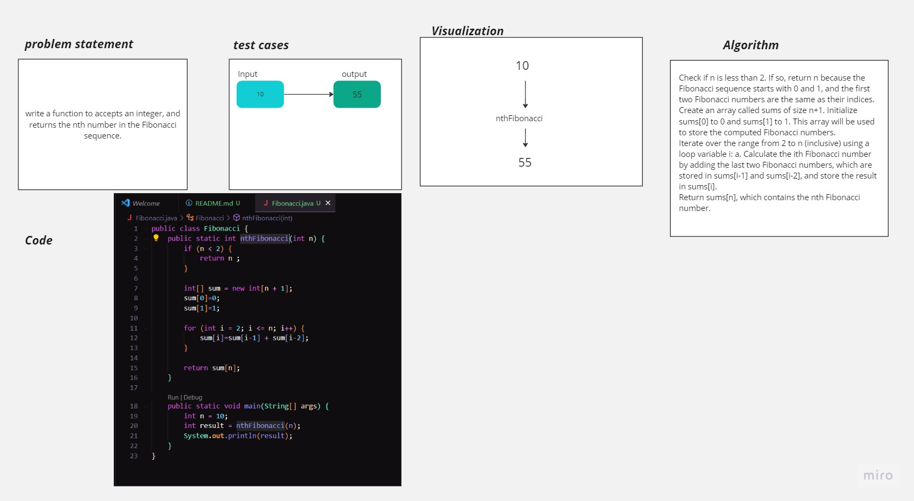

# Fibonacci Sequence
<!-- Description of the challenge -->
The Fibonacci Sequence is the series of numbers:

0, 1, 1, 2, 3, 5, 8, 13, 21, 34, ...

The next number is found by adding up the two numbers before it:
 - the 2 is found by adding the two numbers before it (1+1),
 - the 3 is found by adding the two numbers before it (1+2),
 - the 5 is (2+3),
 - and so on!
write a function to accepts an integer, and returns the nth number in the Fibonacci sequence.

## Whiteboard Process
<!-- Embedded whiteboard image -->

## Approach & Efficiency
<!-- What approach did you take? Why? What is the Big O space/time for this approach? -->
I used an iterative approach to calculate the nth Fibonacci number. Iteration involves building the Fibonacci sequence iteratively from the bottom up by computing and storing the values of each Fibonacci number in an array (sum in this case). This approach is efficient because it avoids redundant calculations by storing previously computed values and reusing them to calculate subsequent values.

## Solution
<!-- Show how to run your code, and examples of it in action -->
Compile the Code:
Open your terminal or command prompt and navigate to the directory where you've saved the Java file (Fibonacci.java). Use the following command to compile the code:
javac Fibonacci.java

Run the Code:
After compiling the code, you can run it using the following command:
java Fibonacci

Provide Input:
The code is currently set to calculate the 10th Fibonacci number. You can modify the n variable in the main method to calculate the Fibonacci number for any desired value of n.

View Output:
The program will print the calculated nth Fibonacci number to the console.
For example, if you run the code with n = 10, you'll see the output:
The 10th Fibonacci number is: 55