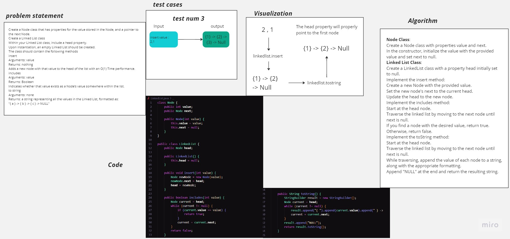

# Linked List
<!-- Description of the challenge -->
 - Node 
 Create a Node class that has properties for the value stored in the Node, and a pointer to the next Node.
 - Linked List
 Create a Linked List class
 Within your Linked List class, include a head property.
 Upon instantiation, an empty Linked List should be created.
 The class should contain the following methods
 - insert
 Arguments: value
 Returns: nothing
 Adds a new node with that value to the head of the list with an O(1) Time performance.
 - includes
 Arguments: value
 Returns: Boolean
 Indicates whether that value exists as a Node’s value somewhere within the list.
 - to string
 Arguments: none
 Returns: a string representing all the values in the Linked List, formatted as:
 "{ a } -> { b } -> { c } -> NULL"

## Whiteboard Process
<!-- Embedded whiteboard image -->

## Approach & Efficiency
<!-- What approach did you take? Why? What is the Big O space/time for this approach? -->
Node Class: I created a Node class with two properties - value to store the data, and next to point to the next node in the linked list. This is a standard approach for implementing singly linked lists.

Linked List Class: I implemented a LinkedList class with the necessary methods based on the requirements you outlined:

insert: This method inserts a new node at the beginning of the linked list. Inserting at the beginning ensures O(1) time complexity, which is more efficient than inserting at the end.
includes: This method searches for a specific value in the linked list by iterating through the nodes. Since we need to examine each node potentially, the time complexity is O(n), where n is the number of nodes in the list.
toString: This method creates a string representation of the linked list by iterating through all nodes. It follows the format "{ value } -> { value } -> ... -> NULL".
Test Cases: I included test cases to validate the correctness of the implemented methods and to verify that the linked list functions as expected.

## Solution
<!-- Show how to run your code, and examples of it in action -->
Compile the Code:
Open a terminal or command prompt and navigate to the directory containing the Java file (LinkedList.java).

Compile the Java code using the following command:

Copy code
javac LinkedList.java
Run the Code:
After successfully compiling the code, you can run the program using the following command:

Copy code
java LinkedList
Example Output:
The program will execute the test cases and print the results to the console. Here's an example of the output you might see:

rust
Copy code
Test 1: Empty Linked List: NULL
Test 2: Insert single node: { 3 } -> NULL
Test 3: Head points to the first node: { 1 } -> { 2 } -> { 3 } -> NULL
Test 4: Insert multiple nodes: { 5 } -> { 4 } -> { 1 } -> { 2 } -> { 3 } -> NULL
Test 5: Value exists (2): true
Test 6: Value does not exist (6): false
Test 7: All values in the linked list: { 5 } -> { 4 } -> { 1 } -> { 2 } -> { 3 } -> NULL
In this example, you can see the output of each test case as it checks various aspects of the linked list's functionality. The test cases cover instantiating an empty linked list, inserting nodes, checking for values, and generating the string representation.

Feel free to modify the values, add more test cases, or explore different scenarios to further test the implementation.