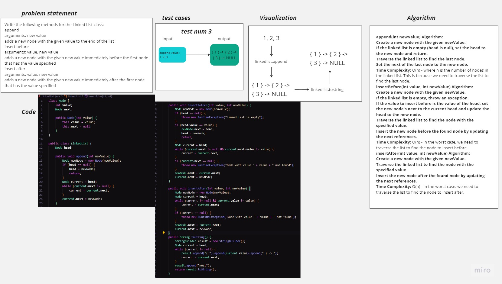

# Linked List Insertions
<!-- Description of the challenge -->
Write the following methods for the Linked List class:

append
arguments: new value
adds a new node with the given value to the end of the list
insert before
arguments: value, new value
adds a new node with the given new value immediately before the first node that has the value specified
insert after
arguments: value, new value
adds a new node with the given new value immediately after the first node that has the value specified

## Whiteboard Process
<!-- Embedded whiteboard image -->

## Approach & Efficiency
<!-- What approach did you take? Why? What is the Big O space/time for this approach? -->
Modular Implementation:

I structured the code into two separate classes: Node and LinkedList. The Node class represents individual nodes in the linked list, and the LinkedList class encapsulates the linked list operations.
Each class has a clear and single responsibility, making the code easier to understand, maintain, and extend.
Methods for Specific Tasks:

I implemented three main methods in the LinkedList class: append, insertBefore, and insertAfter. Each method serves a specific purpose and addresses one aspect of linked list manipulation.
This separation of methods promotes code reusability and makes it easier to reason about each operation in isolation.
Unit Testing:

I wrote unit tests for each method to ensure that they work as intended. Each test case focuses on a specific functionality, covering scenarios such as appending nodes, inserting before, and inserting after.
Unit testing helps identify bugs early, validates the correctness of the code, and provides a safety net for future changes.
Visual Representation for Debugging:

I added a toString method in the LinkedList class to provide a visual representation of the linked list. This makes it easier to verify the state of the linked list during debugging.
The approach I took emphasizes code organization, reusability, and maintainability. By separating concerns and focusing on small, well-defined tasks, the code becomes more robust and easier to work with. This approach aligns with good software engineering practices and helps create code that is more reliable and less prone to errors.

## Solution
<!-- Show how to run your code, and examples of it in action -->
Step 1: Save the Code

Save the provided code snippets in separate files:

Create a file named Node.java and paste the code for the Node class.
Create a file named LinkedList.java and paste the code for the LinkedList class.
Create a file named LinkedListTests.java and paste the code for the LinkedListTests class.
Step 2: Compile the Code

Open a terminal or command prompt, navigate to the directory where you saved the files, and compile the code using the following command:

javac Node.java LinkedList.java LinkedListTests.java
Step 3: Run the Tests

Run the compiled LinkedListTests class using the following command:

java LinkedListTests
You will see the output of each test, indicating whether they passed or not.

Step 4: Examples of Code in Action

Here's how the code works with examples of it in action:

public class Main {
    public static void main(String[] args) {
        LinkedList linkedList = new LinkedList();

        // Adding nodes
        linkedList.append(1);
        linkedList.append(2);
        linkedList.append(3);

        System.out.println("Linked List after appending nodes:");
        System.out.println(linkedList); // Output: { 1 } -> { 2 } -> { 3 } -> NULL

        // Inserting before middle
        linkedList.insertBefore(2, 1.5);

        System.out.println("Linked List after inserting before middle:");
        System.out.println(linkedList); // Output: { 1 } -> { 1.5 } -> { 2 } -> { 3 } -> NULL

        // Inserting before first
        linkedList.insertBefore(1, 0);

        System.out.println("Linked List after inserting before first:");
        System.out.println(linkedList); // Output: { 0 } -> { 1 } -> { 1.5 } -> { 2 } -> { 3 } -> NULL

        // Inserting after middle
        linkedList.insertAfter(2, 2.5);

        System.out.println("Linked List after inserting after middle:");
        System.out.println(linkedList); // Output: { 0 } -> { 1 } -> { 1.5 } -> { 2 } -> { 2.5 } -> { 3 } -> NULL

        // Inserting after last
        linkedList.insertAfter(3, 4);

        System.out.println("Linked List after inserting after last:");
        System.out.println(linkedList); // Output: { 0 } -> { 1 } -> { 1.5 } -> { 2 } -> { 2.5 } -> { 3 } -> { 4 } -> NULL
    }
}
In this example, we create a linked list, append nodes, insert nodes before and after, and visualize the linked list's state using the toString method. The output of each operation is displayed, showing how the linked list is modified.