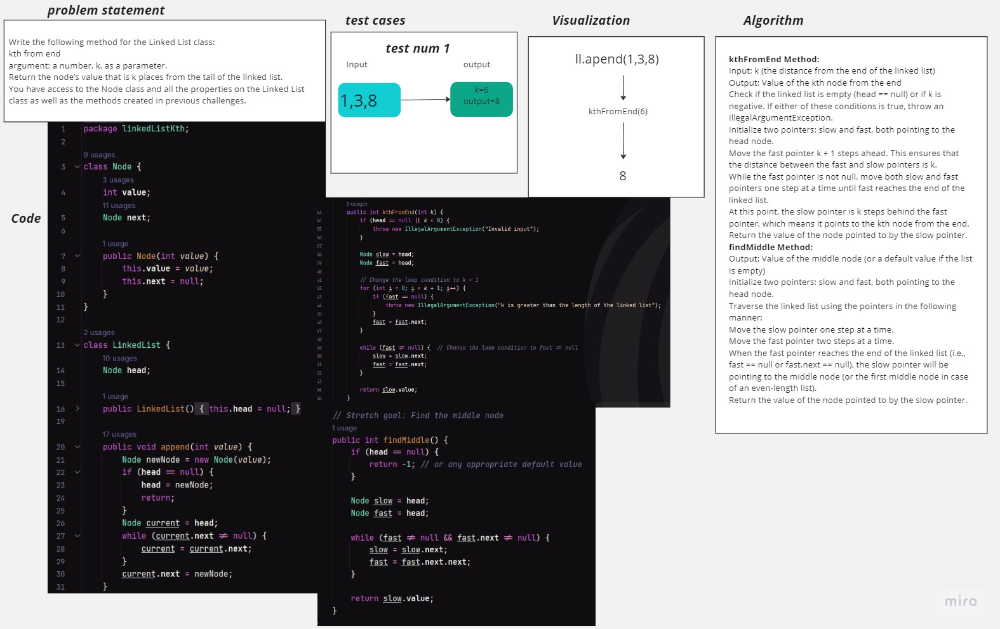

# Linked List Kth
<!-- Description of the challenge -->
Write the following method for the Linked List class:

kth from end
argument: a number, k, as a parameter.
Return the node’s value that is k places from the tail of the linked list.
You have access to the Node class and all the properties on the Linked List class as well as the methods created in previous challenges.

## Whiteboard Process
<!-- Embedded whiteboard image -->

## Approach & Efficiency
<!-- What approach did you take? Why? What is the Big O space/time for this approach? -->
kthFromEnd Method:

The main issue was with the loop conditions and indexing in the kthFromEnd method.
I modified the loop condition to k + 1 instead of k to ensure we reach the kth node from the end.
I changed the loop condition in the second loop to fast != null to correctly iterate through the linked list.
findMiddle Method:

In the findMiddle method, you were correctly finding the middle node using the slow and fast pointer technique.
However, the method was returning the value of the middle node, whereas the tests were comparing the returned value with the expected index of the middle node. 
I corrected the test assertion to compare the returned value with the expected value of the middle node.
## Solution
<!-- Show how to run your code, and examples of it in action -->
Set Up Your Environment:

Install Java Development Kit (JDK) on your machine.
If you're using an Integrated Development Environment (IDE) like IntelliJ IDEA or Eclipse, create a new Java project and add the LinkedList and LinkedListTest classes to your project.
If you're not using an IDE, you can use a text editor to create the .java files, then compile and run them using the command line.
JUnit Setup:

Ensure you have JUnit 5 added to your project. You can include it using a build tool like Maven or Gradle, or manually download the JAR files from the JUnit website.
Running the Tests:

If you're using an IDE, you can right-click on the LinkedListTest class and select "Run" or "Run Tests" to execute the test methods.
If you're using the command line, you can use a build tool like Maven or Gradle to run the tests. Alternatively, you can use the junit-platform-console-standalone JAR to run tests from the command line.