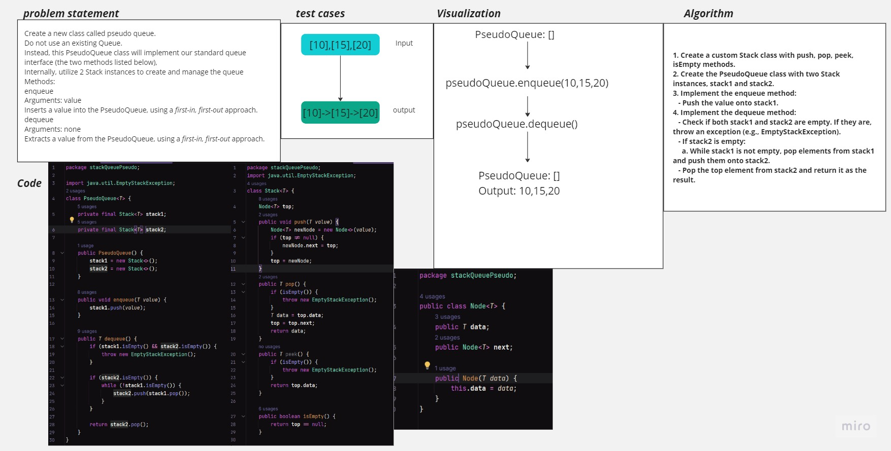

#  Stack Queue Pseudo
<!-- Description of the challenge -->

## Whiteboard Process
<!-- Embedded whiteboard image -->

## Approach & Efficiency
<!-- What approach did you take? Why? What is the Big O space/time for this approach? -->
Stack Data Structure: Stacks are well-suited for implementing queues because they naturally support the Last-In-First-Out (LIFO) behavior, which is the opposite of the desired First-In-First-Out (FIFO) behavior of a queue.

Efficient Enqueue Operation: Enqueuing an element is an efficient operation in a stack. We can simply push the new element onto one of the stacks (stack1 in this case).

Efficient Dequeue Operation: Dequeuing an element from a stack is not efficient because it requires removing the element at the bottom of the stack. However, by using two stacks (stack1 and stack2), we can simulate a queue efficiently. When stack2 is empty (and therefore in the wrong order), we transfer elements from stack1 to stack2 in the correct order. Once stack2 is populated, dequeuing becomes an efficient operation as it mimics the FIFO behavior.

Custom Stack Implementation: We need to implement a custom stack since the standard Java Stack class is based on the Vector class, which is considered legacy. Creating a custom stack allows us to control the implementation details and use a modern approach with a linked list-based implementation.
## Solution
<!-- Show how to run your code, and examples of it in action -->
Create a new Java file, such as PseudoQueueExample.java.

Copy and paste the code I provided in my previous response into the PseudoQueueExample.java file.

Save the file.

Open your terminal or command prompt and navigate to the directory where the PseudoQueueExample.java file is located.

Compile the Java code using the javac command:
javac PseudoQueueExample.java

After compiling successfully, you can run the program using the gradle :
./gradlew test 