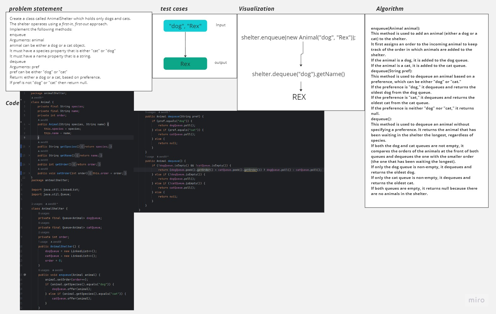

# First-in, First out Animal Shelter
<!-- Description of the challenge -->
 Create a class called AnimalShelter which holds only dogs and cats.
 The shelter operates using a first-in, first-out approach.
 Implement the following methods:
 - enqueue
   - Arguments: animal
     - animal can be either a dog or a cat object.
     - It must have a species property that is either "cat" or "dog"
     - It must have a name property that is a string.
 - dequeue
   - Arguments: pref
     - pref can be either "dog" or "cat"
   - Return: either a dog or a cat, based on preference.
     - If pref is not "dog" or "cat" then return null.
## Whiteboard Process
<!-- Embedded whiteboard image -->

## Approach & Efficiency
<!-- What approach did you take? Why? What is the Big O space/time for this approach? -->
I took a queue-based approach to implement the AnimalShelter class because the problem requires a first-in, first-out (FIFO) order for managing dogs and cats. Here's why I chose this approach:

Queue Data Structure: Queues naturally support the FIFO behavior. When animals are added to the shelter, they are enqueued at the end of their respective queues. When an animal is dequeued, the one that has been waiting the longest (at the front of the queue) is returned.

Separate Queues for Dogs and Cats: To maintain separate queues for dogs and cats, I used two different Queue objects (dogQueue and catQueue). This allows for efficient enqueue and dequeue operations for each species.

Order Property: I introduced an order property to each Animal object, which gets incremented with each enqueue operation. This property ensures that we can determine which animal has been waiting the longest, as requested in the stretch goal.

Polymorphism: The Animal class serves as a common base class for both dogs and cats. This allows for storing objects of both species in their respective queues, simplifying the code while ensuring that each animal has the required properties (species, name, and order).

This queue-based approach is efficient and ensures that animals are managed in the order they arrive at the shelter, adhering to the FIFO principle. It also accommodates the stretch goal of returning the animal that has been waiting the longest when no preference is specified.
## Solution
<!-- Show how to run your code, and examples of it in action -->
Running the Code
Save the provided Java code into a file, e.g., AnimalShelter.java.

Compile the Java code:
javac AnimalShelter.java

Run the Java program:
java AnimalShelter

Examples in Action
Here are some examples of how to use the AnimalShelter class:

public class Main {
public static void main(String[] args) {
AnimalShelter shelter = new AnimalShelter();

        // Enqueue some animals
        shelter.enqueue(new Animal("dog", "Buddy"));
        shelter.enqueue(new Animal("cat", "Whiskers"));
        shelter.enqueue(new Animal("dog", "Max"));
        shelter.enqueue(new Animal("cat", "Mittens"));

        // Dequeue a dog
        Animal adoptedDog = shelter.dequeue("dog");
        System.out.println("Adopted Dog: " + adoptedDog.getName()); // Output: Adopted Dog: Buddy

        // Dequeue a cat
        Animal adoptedCat = shelter.dequeue("cat");
        System.out.println("Adopted Cat: " + adoptedCat.getName()); // Output: Adopted Cat: Whiskers

        // Dequeue based on preference (stretch goal)
        Animal adoptedAny = shelter.dequeue();
        System.out.println("Adopted Any Animal: " + adoptedAny.getName()); // Output: Adopted Any Animal: Max

        // Dequeue based on preference, no preference specified
        Animal adoptedAny2 = shelter.dequeue();
        System.out.println("Adopted Any Animal: " + adoptedAny2.getName()); // Output: Adopted Any Animal: Mittens
    }
}

In this example, we enqueue two dogs and two cats into the AnimalShelter. We then dequeue animals based on preference ("dog" or "cat") and demonstrate the stretch goal, where an animal is dequeued without specifying a preference, in which case the animal that has been waiting the longest is adopted.