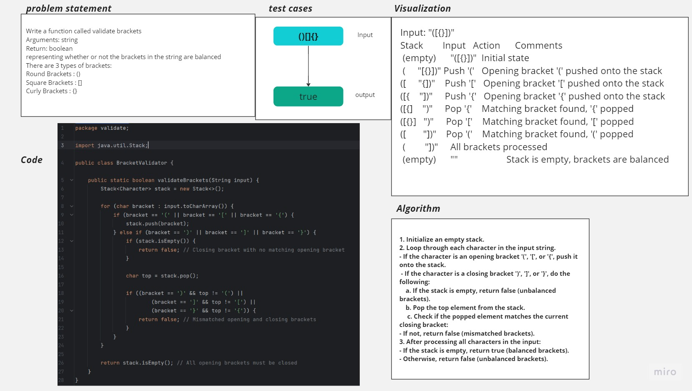

# Multi-bracket Validation.
<!-- Description of the challenge -->
Write a function called validate brackets
 - Arguments: string
 - Return: boolean
 - representing whether or not the brackets in the string are balanced

There are 3 types of brackets:

 - Round Brackets : ()
 - Square Brackets : []
 - Curly Brackets : {}
## Whiteboard Process
<!-- Embedded whiteboard image -->

## Approach & Efficiency
<!-- What approach did you take? Why? What is the Big O space/time for this approach? -->
I took a stack-based approach to validate brackets in the input string. Here's why I chose this approach:

Balancing Requirement: The problem inherently requires that for brackets to be balanced, they should be closed in the correct order. A stack is a natural data structure to keep track of the order in which brackets are opened and closed.

Efficiency: Using a stack allows us to efficiently check for balanced brackets. When we encounter a closing bracket, we can pop the top of the stack (if it's an opening bracket) to check if they match. This approach avoids unnecessary string manipulation and provides a relatively efficient way to validate brackets.

The Big O time and space complexity for this approach are both O(n), where n is the length of the input string:

Time Complexity: In the worst case, we iterate through the entire input string once, so the time complexity is O(n).

Space Complexity: The space complexity is O(n) because in the worst case, we may need to store all opening brackets in the stack before encountering their corresponding closing brackets.
## Solution
<!-- Show how to run your code, and examples of it in action -->

To run the code with JUnit and demonstrate examples of it in action, you need to create a JUnit test class. Here's an example of how you can do this:

```java
import org.junit.jupiter.api.Test;
import static org.junit.jupiter.api.Assertions.*;

public class BracketValidatorTest {

    @Test
    public void testValidBrackets() {
        String input1 = "()[]{}"; // Balanced brackets
        String input2 = "([{}])"; // Balanced brackets

        assertTrue(BracketValidator.validateBrackets(input1));
        assertTrue(BracketValidator.validateBrackets(input2));
    }

    @Test
    public void testInvalidBrackets() {
        String input3 = "([)]";   // Unbalanced brackets
        String input4 = "([{}";   // Unbalanced brackets

        assertFalse(BracketValidator.validateBrackets(input3));
        assertFalse(BracketValidator.validateBrackets(input4));
    }

    @Test
    public void testEmptyString() {
        String input5 = "";       // Empty string should be considered balanced

        assertTrue(BracketValidator.validateBrackets(input5));
    }
}
```

In this example, we have a JUnit test class `BracketValidatorTest` with three test methods:

1. `testValidBrackets`: Tests cases with balanced brackets and expects `true`.
2. `testInvalidBrackets`: Tests cases with unbalanced brackets and expects `false`.
3. `testEmptyString`: Tests an empty string and expects `true` (since an empty string is considered balanced).

To run these tests, you'll need a testing framework like JUnit. You can use an integrated development environment (IDE) like Eclipse, IntelliJ IDEA, or run the tests from the command line use Gradle.

