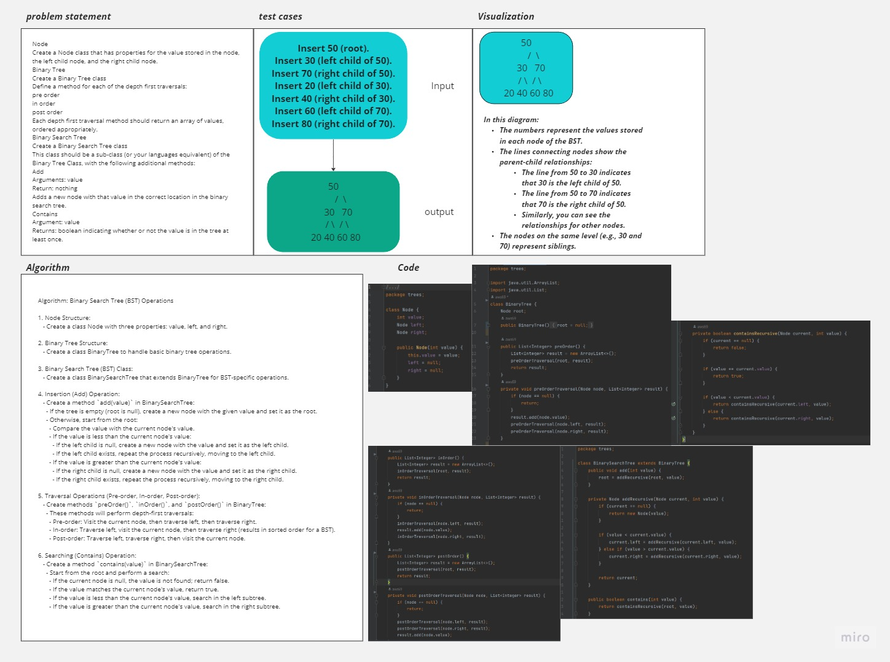

# Implementation: Trees
<!-- Description of the challenge -->
1. **Node Class**:
   - Create a `Node` class that has properties for the value stored in the node, the left child node, and the right child node.

2. **Binary Tree Class**:
   - Create a `BinaryTree` class.
   - Define methods for the following depth-first traversals:
     - Pre-order traversal.
     - In-order traversal.
     - Post-order traversal.
   - Each depth-first traversal method should return an array of values, ordered appropriately.

3. **Binary Search Tree Class**:
   - Create a `BinarySearchTree` class that is a sub-class of the `BinaryTree` class.
   - Add an `add` method:
     - Arguments: `value`.
     - Return: Nothing.
     - Adds a new node with that value in the correct location in the binary search tree.
   - Add a `contains` method:
     - Argument: `value`.
     - Returns: A boolean indicating whether or not the value is in the tree at least once.

## Tests

Write tests to prove the following functionality:

- Can successfully instantiate an empty tree.
- Can successfully instantiate a tree with a single root node.
- For a Binary Search Tree, can successfully add a left child and right child properly to a node.
- Can successfully return a collection from a pre-order traversal.
- Can successfully return a collection from an in-order traversal.
- Can successfully return a collection from a post-order traversal.
- Returns `true` or `false` for the `contains` method, given an existing or non-existing node value.

## Guidelines

- Implement the classes and methods following the Single Responsibility Principle.
- Follow Java naming conventions and use appropriate exceptions for error handling.
- Use JUnit for testing and ensure that the tests print the values or results in the terminal.

## Whiteboard Process
<!-- Embedded whiteboard image -->

## Approach & Efficiency
<!-- What approach did you take? Why? What is the Big O space/time for this approach? -->
The code implements a Binary Search Tree (BST) and its methods :

- **Node Class:** Represents a node in the BST with constant space complexity (O(1)).

- **Binary Tree Class:** Handles depth-first traversals (pre-order, in-order, post-order) with a space complexity of O(h), where "h" is the height of the tree, and time complexity of O(n) for each traversal.

- **Binary Search Tree Class:** A subclass of BinaryTree that adds nodes in O(log n) time on average (O(n) worst-case) and checks for values in O(log n) time on average (O(n) worst-case).

Overall, the time and space complexity depend on the tree's balance, with average-case complexities being better than worst-case complexities. Using a self-balancing tree structure can help maintain better average-case performance.

## Solution
<!-- Show how to run your code, and examples of it in action -->

1. **Setup Gradle:**

   Ensure you have Gradle installed on your system. You can download and install it from the official website: https://gradle.org/install/

2. **Create a Gradle Project:**

   If you haven't already, create a Gradle project directory and initialize it:

   ```bash
   mkdir BinarySearchTreeProject
   cd BinarySearchTreeProject
   gradle init --type java-application
   ```

   This will create a basic Gradle project structure.

3. **Project Structure:**

   Organize your project structure as follows:

   ```
   BinarySearchTreeProject/
   ├── src/
   │   ├── main/
   │   │   └── java/
   │   │       └── (Your Java files)
   │   └── test/
   │       └── java/
   │           └── (Your JUnit test files)
   └── build.gradle
   ```
4. **Write JUnit Tests:**

   Write your JUnit tests as shown in the previous responses. Ensure that they are in the `src/test/java` directory.

5. **Run JUnit Tests:**

   Open your terminal/command prompt, navigate to the project root directory (`BinarySearchTreeProject`), and run the tests using Gradle:

   ```bash
   gradle test
   ```

   Gradle will compile your code and execute the JUnit tests. You will see the test results in the terminal, including any print statements you added within the test methods.

The test results will show you if the code passes or fails the specified tests, and it will display any printed output from the tests.

Please make sure your project structure aligns with the one described, and your JUnit tests are correctly written in the `src/test/java` directory.