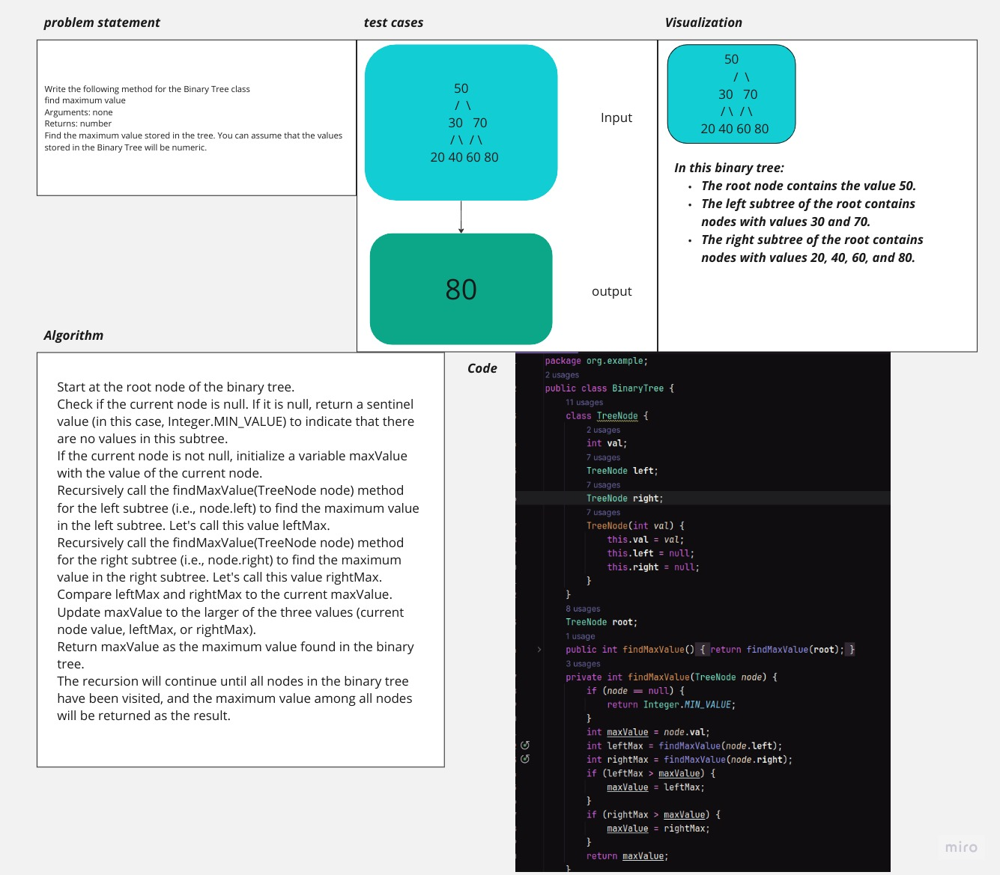

# Tree Max
<!-- Description of the challenge -->
Write the following method for the Binary Tree class

find maximum value
Arguments: none
Returns: number
Find the maximum value stored in the tree. 
You can assume that the values stored in the Binary Tree will be numeric.
## Whiteboard Process
<!-- Embedded whiteboard image -->
pg]
## Approach & Efficiency
<!-- What approach did you take? Why? What is the Big O space/time for this approach? -->
**Approach Explanation:**

1. We start with the root of the binary tree and initialize the maximum value as the value of the root node.
2. Then, we recursively traverse the left subtree and right subtree.
3. During this traversal, at each node, we compare the node's value with the current maximum value and update the maximum value if necessary.
4. We continue this process until we have traversed the entire tree.

**Big O Time Complexity:**

The time complexity of this approach is O(n), where 'n' is the number of nodes in the binary tree. This is because we visit each node in the tree exactly once in a depth-first manner. In the worst case, we might need to visit all nodes to find the maximum value.

**Big O Space Complexity:**

The space complexity of this approach is O(h), where 'h' is the height of the binary tree. This space is used for the recursive call stack. In the worst case, when the binary tree is skewed (essentially a linked list), the height 'h' becomes 'n' (the number of nodes), leading to a space complexity of O(n). In a balanced binary tree, the height 'h' is O(log n), resulting in a space complexity of O(log n).
## Solution
<!-- Show how to run your code, and examples of it in action -->
1. Create a Java class (e.g., Main) to test the code.

2. Copy the BinaryTree class definition and method into your Main class or create a separate BinaryTree class file.

3. Create a main method in your Main class to demonstrate how to use the BinaryTree class.